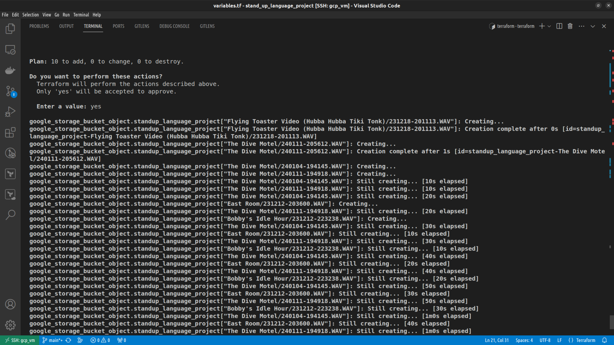
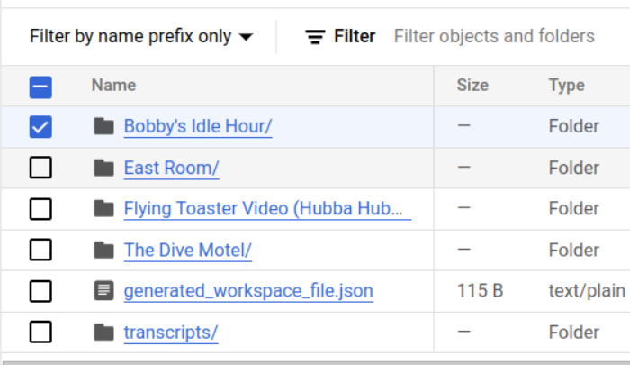

# Clatyor's Log
**02/08/2024**
- Made repository public
- Cloned repository to GCP VM
- Used `wget` to download recordings from dropbox using share link
    - note that you need to specify the extension as `.zip` such as `wget -O <fileName><URL>`
- used `unzip <filename.zip>` to extract to `/recordings`
- Decided to use the google speech cloud service for transcription.
    - Created a new workspace on the speech platform.
    - Google Speech needs a way to get the files, so manually created created a GCS bucket.
- I started to upload the files manually, but then I remembered that I recently learned how to use terraform.
- Created `main.tf` and `variables.tf` files to push to the bucket.
    > Note: since I didn't create the bucket with terraform, I need to import it via BASH
    ```bash terraform import google_storage_bucket.my_bucket existing-bucket-name```
- Here's what I did
    - ```bash terraform init```
    - ``` bash terraform import [options] ADDRESS ID```
    - ```bash terraform plan```
    - ```bash terraform apply```
- OMG IT WORKED!!!  Transferred All of the .WAV files from my GCP Compute VM to A new storage bucket!

